<div align="center">

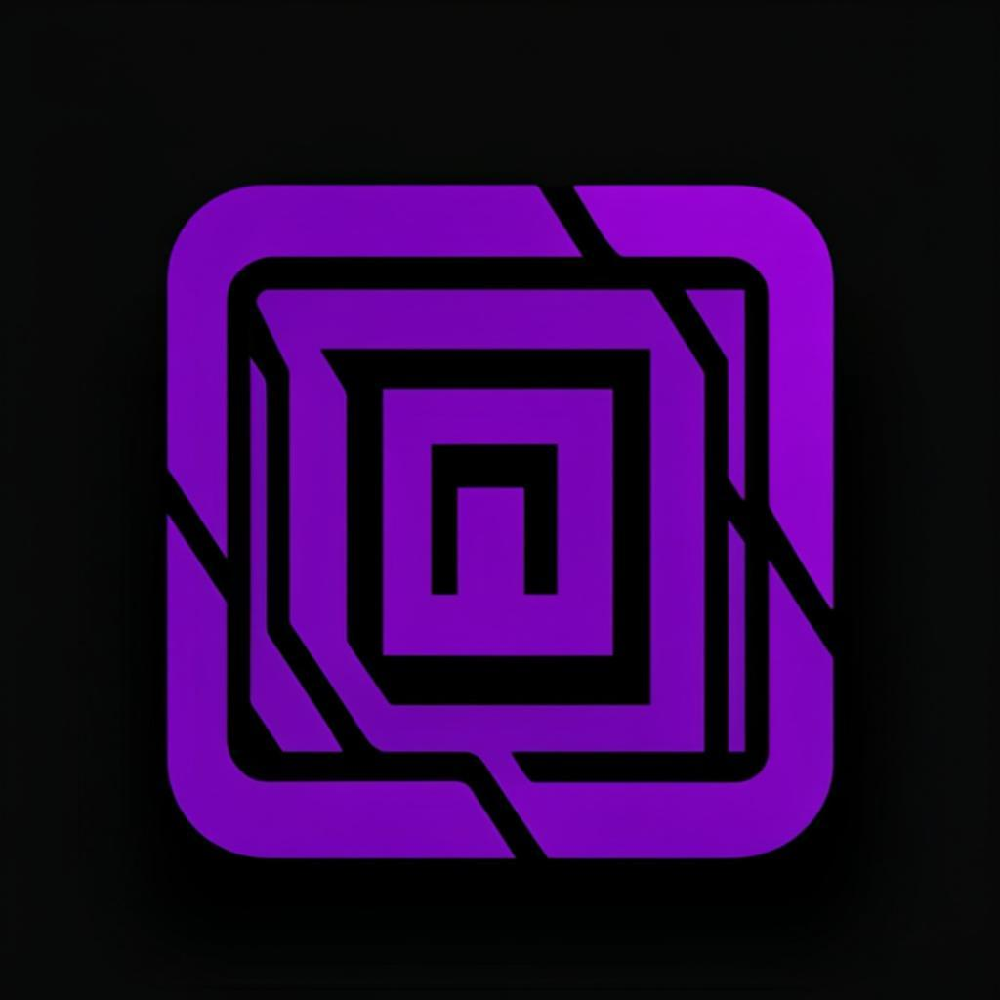

# DXN1 STUDIO

**The clean, modern IDE. Built for flow. Now with a brain.**

A from-scratch desktop IDE in pure Python + Tkinter — animated boot splash,
Project Hub, workspaces, syntax highlighting, a Git panel, command palette
with `@` symbol jump, sandboxed AI agents on a **resilient free cloud stack**
(no account, no API key) or your own key. No Electron. No Node. No
frameworks. ~10 MB of Python.

[](https://github.com/DXN1-termux/DXN1-STUDIO/actions/workflows/ci.yml)
[](CHANGELOG.md)
[](https://www.python.org)
[](#requirements)
[](LICENSE)
[](https://github.com/DXN1-termux/DXN1-STUDIO/stargazers)
[](https://github.com/DXN1-termux/DXN1-STUDIO/issues)
[](CONTRIBUTING.md)
[](https://docs.python.org/3/library/tkinter.html)

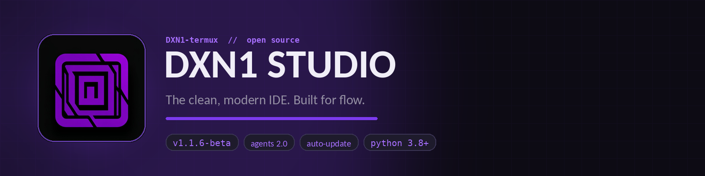

*Every screenshot in this README is the real app, captured headlessly with
Xvfb — nothing is mocked.*

</div>

---

## ⚡ DXN1 STUDIO 2 — the DS2 sprint

DXN1 STUDIO 2 (**DS2**) is a feature sprint that supercharges the studio
while keeping its soul: pure Python, no Electron, no frameworks, no
bloat. Six releases in one push — here's the tour:

| | Feature | One-liner |
|---|---|---|
| ⎇ | **Visual Git Suite** | A word-level **diff viewer** (split + unified), an interactive **commit graph** across all branches, and a full **branch manager** — merge, rename, track, force-delete with two-click confirms |
| ◈ | **Agent memory** | Per-workspace memory bank — say `remember: …` in the chat and the agent recalls it every session, injected straight into its system prompt |
| ⌁ | **Token usage dashboard** | Where your tokens went: 14-day chart, per-model bars, cost estimates, CSV export |
| ⚡ | **AI quick actions** | Select code → Explain / Refactor / Docstring / Tests / Fix bugs / Type hints / Optimize — streamed, with one-click Insert or Replace-selection |
| ✨ | **AI commit messages** | The ✨ chip in Source Control drafts a Conventional Commits message from your staged diff |
| ◉ | **AI review** | "Gutter eyes" — whole-file review with severity-coloured findings that jump to the line |
| ⇉ | **Pair mode** | Plan → agree → build: the agent writes a numbered plan, you approve it, then it executes through the same sandboxed engine |
| ⌘ | **Cheat sheet + checklist** | A searchable shortcut/feature reference (Help → DS2 Cheat Sheet) and a first-run starter checklist |
| ⌂ | **Project Hub v2** | Pinned workspaces, live per-project stats, instant search, **12 scaffolds** — Rust and Go included |
| ◑ | **Theme gallery** | 12 curated palettes with live swatch previews, plus a safe custom-theme engine (broken themes can't break the studio) |
| ⏺ | **Editor power tools** | Macro recorder, multi-cursor engine, snippet system with tabstops and variables |

**Every DS2 feature is a palette command** — hit `Ctrl+K` and type.
Full details: [`docs/FEATURES.md`](docs/FEATURES.md) ·
Architecture: [`docs/ARCHITECTURE.md`](docs/ARCHITECTURE.md) ·
Shortcuts: [`docs/KEYBINDINGS.md`](docs/KEYBINDINGS.md)

---

## Table of contents

- [⚡ DXN1 STUDIO 2 — the DS2 sprint](#-dxn1-studio-2--the-ds2-sprint)
- [Screenshots](#screenshots)
- [Why DXN1 STUDIO](#why-dxn1-studio)
- [Install](#install)
- [Launch](#launch)
- [First launch](#first-launch)
- [Project Hub](#project-hub)
- [The IDE](#the-ide)
- [Source Control — Git without leaving the studio](#source-control--git-without-leaving-the-studio)
- [DXN1 Agents](#dxn1-agents)
- [The Update Portal](#the-update-portal)
- [Packages — lightweight by default](#packages--lightweight-by-default)
- [Export](#export)
- [Keyboard & terminal](#keyboard--terminal)
- [Requirements](#requirements)
- [Project structure](#project-structure)
- [Roadmap](#roadmap)
- [Contributing](#contributing)
- [License](#license)

## Screenshots

<table>
<tr>
<td width="50%" align="center">
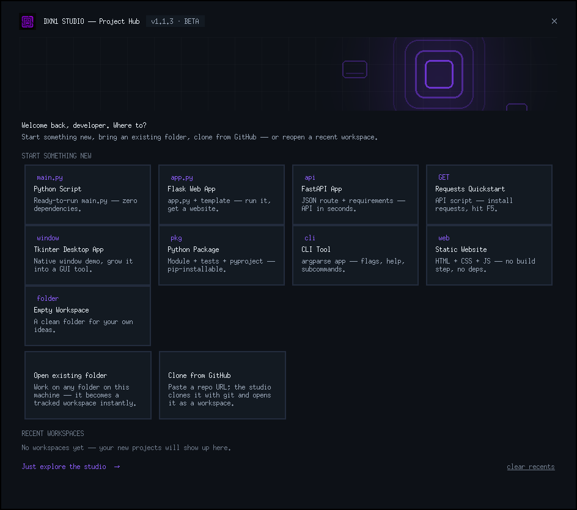<br/>
<b>Project Hub</b> — nine scaffolds, open any folder, clone from GitHub, or jump back into a recent workspace
</td>
<td width="50%" align="center">
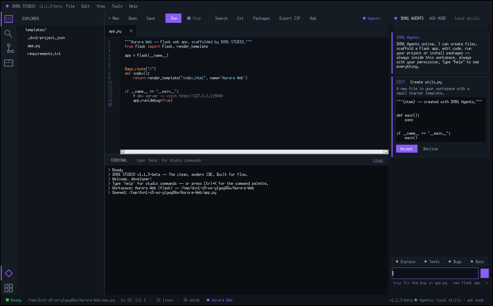<br/>
<b>The IDE + DXN1 Agents</b> — every agent edit arrives as a diff card with Accept / Decline
</td>
</tr>
<tr>
<td width="50%" align="center">
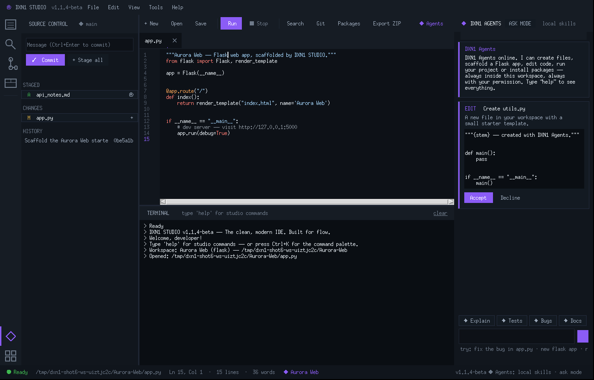<br/>
<b>Source Control panel</b> — stage, unstage, commit and browse history without leaving the studio
</td>
<td width="50%" align="center">
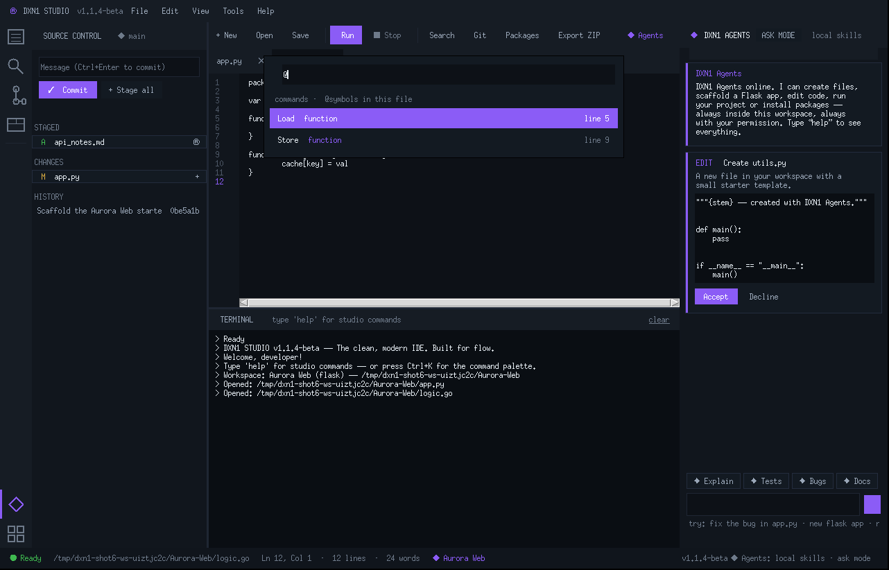<br/>
<b>Command palette</b> — Ctrl+K over every command, type <code>@</code> to jump to symbols
</td>
</tr>
</table>

<details>
<summary><b>More screenshots</b> — wizard, split editor, quick open, packages, light theme, splash</summary>

<table>
<tr>
<td width="50%" align="center">
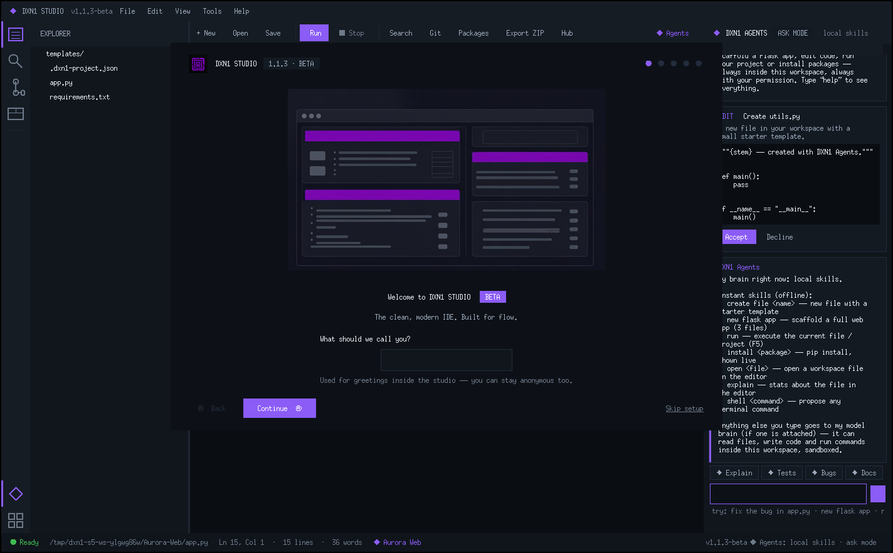<br/>
<b>Welcome wizard</b> — name, theme, first project, optional agents — five steps
</td>
<td width="50%" align="center">
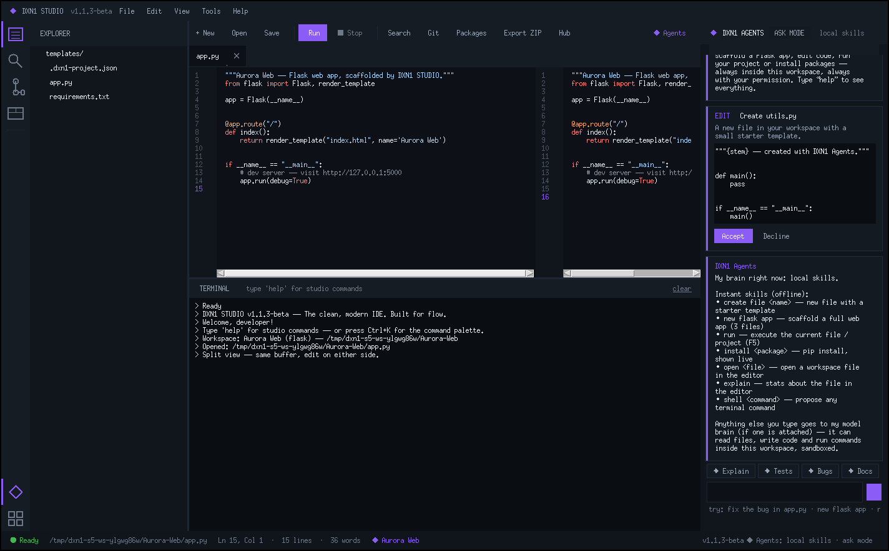<br/>
<b>Split editor</b> — same buffer, edit on either side (Ctrl+\)
</td>
</tr>
<tr>
<td width="50%" align="center">
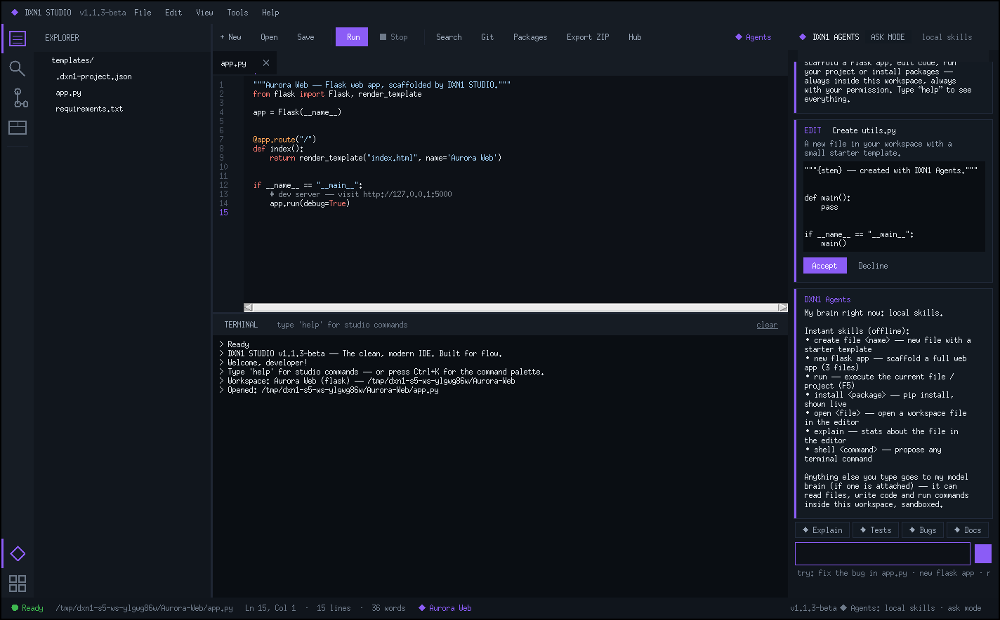<br/>
<b>Agent skills</b> — offline helpers plus one-tap quick actions
</td>
<td width="50%" align="center">
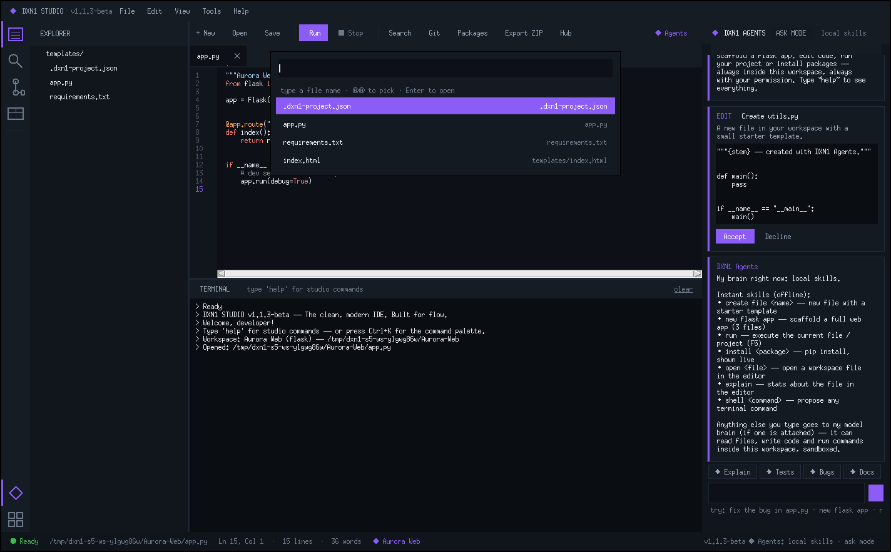<br/>
<b>Quick open</b> — Ctrl+P, fuzzy across the whole workspace
</td>
</tr>
<tr>
<td colspan="2" align="center">
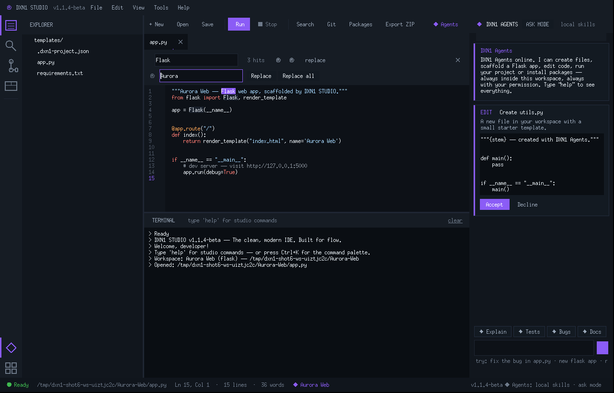<br/>
<b>Find &amp; Replace</b> — Ctrl+H, live hits, Replace all as one undo step
</td>
</tr>
<tr>
<td colspan="2" align="center">
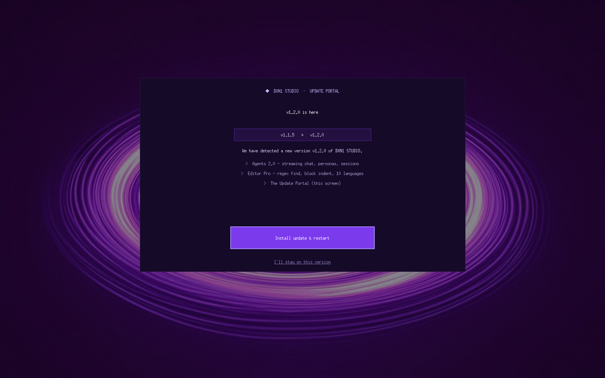<br/>
<b>The Update Portal</b> — a new release opens a full-screen takeover: install &amp; restart in one click, with honest progress
</td>
</tr>
<tr>
<td width="50%" align="center">
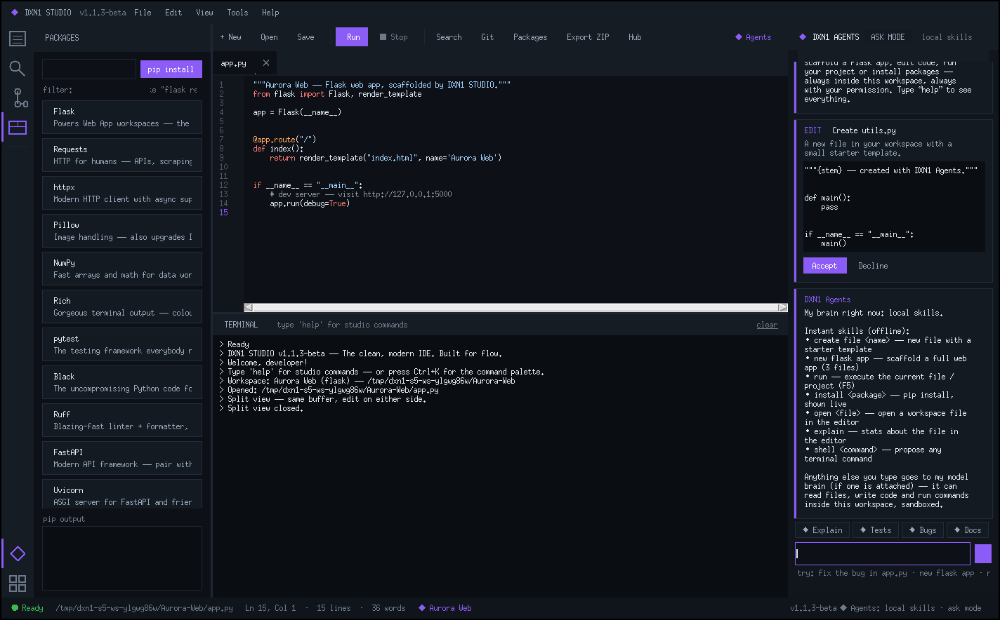<br/>
<b>Packages view</b> — the one opt-in place for the heavy stuff
</td>
<td width="50%" align="center">
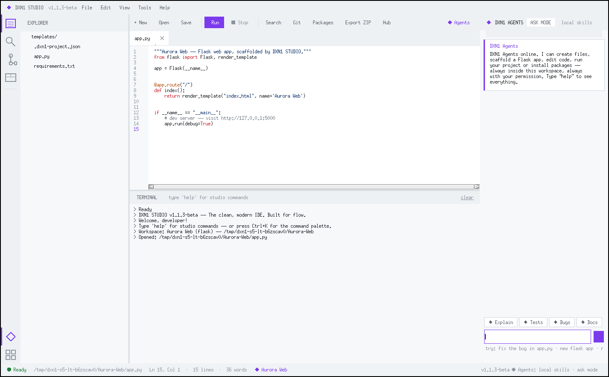<br/>
<b>Light theme</b> — dark & light, six accent colours, editor text size to taste
</td>
</tr>
<tr>
<td colspan="2" align="center">
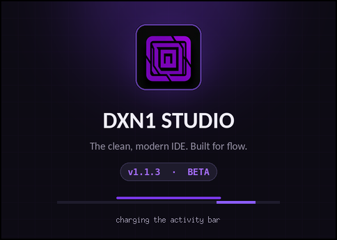<br/>
<b>Boot splash</b> — brand card, shimmer progress, rotating status lines
</td>
</tr>
</table>

</details>

## Why DXN1 STUDIO

| | DXN1 STUDIO | Typical Electron IDE |
|---|---|---|
| RAM at idle | ~60–90 MB (it's Tkinter) | 400 MB – 1.5 GB |
| Install size | ~10 MB, one curl command | 300+ MB |
| Startup | instant, animated brand splash | spinner city |
| AI agents | free cloud stack, **no account needed**, sandboxed to your workspace | BYOK only, often cloud-tied |
| Git | stage / commit / log built in | usually an extension |
| Dependencies | Python 3.8 + Tkinter. That's the list | ships a browser |
| Network stack | stdlib `urllib` | bundled Chromium |

Built to run beautifully everywhere Python runs — including **Termux on
Android**, old laptops, and Raspberry Pi boards that would melt under
Electron.

## Install

One command — global install, launcher on your PATH:

```bash
curl -fsSL https://raw.githubusercontent.com/DXN1-termux/DXN1-STUDIO/master/install.sh | bash
```

<details>
<summary><b>Manual install</b> (no curl-pipe-bash, we respect that)</summary>

```bash
git clone https://github.com/DXN1-termux/DXN1-STUDIO.git
cd DXN1-STUDIO
./install.sh            # same installer, local copy
# or run straight from the tree:
python3 dxn1-studio
```

</details>

If `dxn1` isn't found afterwards:

```bash
export PATH="$HOME/.local/bin:$PATH"
```

## Launch

The boot sequence: animated brand card for ~2 seconds, then the studio rises.

```bash
dxn1 studio          # the classic way
dxn1                 # also fine
DXN1 STUDIO          # uppercase, unquoted → shell runs DXN1 with arg STUDIO
"DXN1 STUDIO"        # the launcher literally named with a space. Yes.
dxn1 studio ~/my-app # boot straight into a workspace
```

Useful flags:

```bash
dxn1 studio --reset-config    # wipe preferences and replay the welcome wizard
dxn1 studio --no-splash       # skip the boot splash this once
dxn1 studio --smoke-test      # headless self-check (CI-safe, temp config)
```

## First launch

1. **Boot splash** — brand card with a shimmer bar and rotating status lines
   (click to skip)
2. **Welcome wizard** — hero splash + your display name
3. **Make it yours** — dark/light theme, six accent colours, editor text size
4. **First project** — tell the studio what you're building (or skip)
5. **DXN1 Agents** *(optional)* — opt in and pick a brain right in the wizard
6. **Project Hub** — create your first workspace or explore the studio
7. **Guided tour** — a short spotlight walk across the real UI

Replay the wizard or tour anytime from the **Help** menu — or type
`dxn1 studio` in the terminal to replay the splash, because why not.

## Project Hub

Every session starts at the Hub — ten scaffolds and counting:

| | |
|---|---|
| **New Python Script** | ready-to-run `main.py`, zero dependencies |
| **New Flask Web App** | `app.py` + template + `requirements.txt` |
| **New FastAPI App** | JSON route starter + requirements |
| **New CLI Tool** | argparse app with subcommands, flags and help text |
| **New Static Website** | HTML + CSS + JS, no build step, no dependencies |
| **New Canvas Game** | a complete playable game loop — arrows/WASD, lives, score, restart |
| **New Tkinter App** | native desktop starter |
| **New Python Package** | src-style module + tests + `pyproject.toml` |
| **Empty Workspace** | a clean folder, your ideas |
| **Open existing folder** | any folder becomes a tracked workspace |
| **Clone from GitHub** | paste `owner/repo` or a URL, watch `git clone` live |
| **Recent workspaces** | one click back in, relative timestamps, per-row remove |

Workspaces can live anywhere; DXN1 keeps track in `~/.dxn1-studio/config.json`.
Reopen via **File → Project Hub**.

## The IDE

**Editing**
- Syntax highlighting for Python, HTML/CSS/JS/TS, JSON, Markdown, **Go,
  Rust, Java, C/C++, C#, Kotlin, PHP, Ruby and Shell** — regex-based,
  zero dependencies, theme-aware
- Tab buffers with unsaved ● markers, Ctrl+W close, Ctrl+Tab cycle,
  right-click tabs for *close others / close all / copy path / reveal*
- Auto-indent (deeper after `:`), auto-close brackets and quotes with
  type-over, matching-bracket spotlight, current-line wash
- **Line ops** — toggle comment (Ctrl+/), duplicate, delete, move lines
- **Block indent / outdent** — Tab and Shift+Tab (or Ctrl+] / Ctrl+[)
  shift the whole selection; brackets stay one undo step
- **Word spotlight** — pause on any identifier and every occurrence
  lights up softly (3+ characters, never while you're mid-selection)
- **Bookmarks** — click a line number or Ctrl+F2; F2 / Shift+F2 walk them
- **Snippets** — Tab expands `ifmain`, `pdb`, `smain`; plain indent otherwise
- In-file find bar (Ctrl+F) with hit counting and prev/next, **regex
  mode** via the `.*` toggle — patterns in, `\1`-style templates out —
  **Find & Replace** (Ctrl+H) with Replace all as one undoable step, Go
  to Line (Ctrl+G), word wrap toggle, Ctrl+ +/− text size, auto-save
  option
- Full undo/redo history; word/selection/line counts in the status bar

**Moving around**
- **Activity bar** — slim icon rail: Explorer, Search, **Source Control**,
  Packages + Hub and Agents shortcuts
- **Command palette** — Ctrl+K, fuzzy over every command; type **`@`** to
  jump to symbols — Python & JS/TS, plus Go, Rust, Java, Kotlin, C/C++,
  C#, Swift, Dart and PHP outlines
- **Quick open** — Ctrl+P, fuzzy across the entire workspace
- **Find-in-files** — workspace-wide search, grouped results, click to jump
  to the exact line
- **Split editor** (Ctrl+\) — one buffer, two live views
- **Zen mode** (Ctrl+Alt+Z) — everything away but the editor

**Running**
- **F5** executes the active file (or the workspace's `app.py`/`main.py`)
  and streams output live into the terminal
- **Interactive terminal** with studio commands (below) — ANSI stripped,
  progress-bar friendly, log capped so long runs stay light
- **Searchable settings** (Ctrl+,) — type to filter every preference row

**Quality of life**
- Themed in-app menu bar — dark mode never flashes a system-white strip
- Toasts for saves, exports, errors; session restore reopens your tabs
- **The Update Portal** — full-screen, cinematic update experience (below)
- Uncaught exceptions land in `~/.dxn1-studio/logs/studio.log` with a
  friendly toast instead of a dead window

## Source Control — Git without leaving the studio

The **Source Control** sidebar speaks plain `git` through `subprocess` —
no libraries, no daemons:

- branch chip + changed files grouped into **Staged** and **Changes**
- per-file stage / unstage (`+` / `−`), **Stage all**, one-click **Commit**
  (auto-stages when nothing is staged yet)
- recent **history** list, untracked files flagged, merge conflicts marked
- a folder with no repo gets a one-click **git init** card
- `git <anything>` works in the terminal too — `git status`, `git log`,
  `git diff` stream live into the output pane

## DXN1 Agents

The built-in copilot. Two layers:

### Instant skills — offline, always available

No key, no network, no setup:

```text
create file utils.py        → starter template, created in your workspace
new flask app               → complete scaffold, wired and ready
run                         → executes your project
install flask               → pip, streamed into the terminal
open app.py                 → opens any workspace file
explain                     → analyzes the editor buffer
shell python -V             → proposes raw commands (you approve)
```

Plus **quick actions** — one tap above the input:
`✦ Explain` · `✦ Tests` · `✦ Bugs` · `✦ Docs` · `✦ Refactor` fire
crafted prompts at the open file.

And a **`search_code` tool** — the agent greps the whole workspace with
a regex before asking you where something lives.

### Agents 2.0 — the chat, rebuilt

- **Streaming answers** — tokens land live with a working **■ stop**
  button; interrupt any run, keep the partial answer
- **Markdown chat** — headings, bullets and fenced code render as real
  cards; every code block ships **Copy · To editor · Save as…** and a
  language chip
- **6 personas** — Balanced · Concise · Senior dev · Architect ·
  Debugger · Teacher — one tap swaps the system prompt
- **Slash commands** — `/help`, `/new`, `/tests`, `/bugs`, `/explain`,
  `/run`, `/persona senior`, `/brain`, `/stop`… with an arrow-key
  palette right in the input
- **@-mentions** — type `@` to attach any workspace file to the prompt;
  it rides along with the next message
- **Session history** — chats auto-save per workspace and survive
  restarts (including update restarts); `/sessions` reopens any of them

### Model brains — pick one in Settings → DXN1 Agents

| Brain | What it is | Cost |
|-------|------------|------|
| **Local skills** | The offline rule engine | free, no setup |
| **Free cloud** | Keyless cloud models with **automatic failover** — proper web headers keep the anonymous route open, provider out-of-budget boilerplate is detected and skipped, GitHub Models takes over when a GitHub login exists. The header chip always names the provider that answered | free, rate-limited |
| **BYOK** | Your key on any OpenAI-compatible provider — OpenRouter, Groq, Google AI Studio, Mistral, OpenAI, Ollama (local), custom endpoint | your key; OpenRouter `:free` models cost nothing |
| **GitHub Models** | Free tier tracked via your GitHub login | free, rate-limited |
| **Kilo gateway** | Free-model routing through an in-studio HTTP client — deliberately *not* a bundled Kilo instance, so it adds near-zero RAM instead of hundreds of MB | your Kilo token |

The whole backend layer is standard-library `urllib` — no SDKs, no Node, no
helper processes. Backends that report usage feed a live `steps · tokens`
counter under the chat input.

**Connect a brain — inside the app.** Providers that need a login are wired
through the in-app **Connect** flow: the studio opens the provider page, you
sign in, paste the token back into the studio window, hit Test & Save.
Nothing is handed to other apps; keys live only in
`~/.dxn1-studio/config.json` on your machine. Live model lists can be fetched
per provider from the settings page.

### System prompt, your way

- **Style presets** — Default / Concise / Senior dev / Custom
- **Extra instructions** — persona, house style, quirks; in Custom mode your
  text *is* the personality
- **Preview** — see the exact effective system prompt (sandbox boundaries and
  live workspace listing included) before saving

### Sandbox — the hard boundary

The agent cannot see or touch your machine. Only your open workspace:

- only paths resolving *inside the workspace* are reachable; `..` traversal,
  absolute escapes and symlink escapes are rejected
- `.git`, `.ssh` and studio internals are off-limits to reads *and* writes
- commands run with the workspace as working directory
- **catastrophic commands** (`rm -rf /`, `sudo`, pipe-to-shell downloads,
  raw disk writes, forced pushes…) always require an explicit human Accept —
  even in full-access mode

### Permission model — the whole point

- **Ask mode** *(default)* — every edit arrives as a unified-diff card with
  **Accept / Decline**; every command is a proposal card
- **Full access** — turn both prompts off in agent settings and it stops
  asking; edits apply and commands run immediately (dangerous ones still ask)
- Disable the assistant entirely and the panel disappears

## The Update Portal

When a new release lands on GitHub, the studio doesn't whisper in a
toast — it opens the **Update Portal**: a full-screen, cinematic
takeover built around the studio's portal art. The detected version
sits front and centre — *"We have detected a new version v1.1.5 of
DXN1 STUDIO"* — alongside the release highlights and one big button:
**Install update & restart**.

Installing streams the new build straight from GitHub (or `git pull`
when you cloned), verifies every module with `compileall`, and shows
honest progress for at least three seconds — then the studio restarts
itself into the fresh build. Your projects, chats, sessions and
settings stay exactly as they are.

You can still say *"I'll stay on this version"* — but the portal
answers honestly: **"You cannot continue on this version — for
security and for your own experience reasons."** Old builds miss
security fixes and polish; the studio would rather say goodbye than
leave you exposed. Exit, or think better of it and install on the
spot. (Checks happen at launch, and manually any time via
**Help → Check for Updates**.)

## Packages — lightweight by default

DXN1 installs **nothing** behind your back. The **Packages** sidebar view (or
Tools → Manage Packages) is the single opt-in place for the heavy stuff:
Flask, Requests, httpx, Pillow, NumPy, Rich, pytest, Black, Ruff, FastAPI,
Uvicorn — with a filter box, live `pip` output, version detection and
uninstall. Power users can pip-install anything from the same view.

## Export

- **File → Export Project as ZIP…** — the whole workspace, caches and venvs
  skipped; Flask projects automatically get a `requirements.txt`
- **File → Export Current File As…** — just the file you're editing

## Keyboard & terminal

| Shortcut | Action |
|---|---|
| Ctrl+N / Ctrl+O / Ctrl+S | new / open / save |
| Ctrl+W · Ctrl+Tab | close tab · cycle tabs |
| Ctrl+K or Ctrl+Shift+P | command palette — type `@` for symbols |
| Ctrl+P | quick open a file |
| Ctrl+F | find in file |
| Ctrl+H | find & replace (Replace all = one undo step) |
| Ctrl+G | go to line |
| Ctrl+/ | toggle comment |
| Ctrl+Shift+D / Ctrl+Shift+K | duplicate / delete line |
| Alt+Up / Alt+Down | move line up / down |
| Tab | expand snippet (`ifmain` · `pdb` · `smain`) |
| Ctrl+F2 · F2 · Shift+F2 | bookmark line · next · previous |
| Ctrl+\ | split editor |
| Ctrl+Alt+Z | zen mode |
| F5 | run project |
| Ctrl+, | settings |

Terminal one-liners: `run` · `stop` · `clear` · `packages` · `search <q>` ·
`find <text>` · `palette` · `todo` · `git <args>` · `goto <line>` · `recent` ·
`hub` · `export` · `agent <request>` · `settings` — and `dxn1 studio` replays
the boot splash, because why not.

## Requirements

| | |
|---|---|
| Python | 3.8+ |
| Tkinter | usually bundled; Debian/Ubuntu/Termux: `apt install python3-tk` |
| git | optional — powers the Source Control panel and GitHub cloning |
| Pillow | optional — crisp image scaling, falls back automatically |
| Everything else | opt-in via the Packages view |

## Project structure

<details>
<summary><b>Inside the tree</b></summary>

```
DXN1-STUDIO/
├── dxn1                     # CLI launcher (dxn1 studio / "DXN1 STUDIO")
├── DXN1 STUDIO              # yes, a launcher with a space
├── dxn1-studio              # classic entry point
├── dxn1_studio/
│   ├── app.py               # Main window, menu bar, palette, tabs, boot flow
│   ├── config.py            # ~/.dxn1-studio/config.json persistence
│   ├── theme.py             # Dark/light palettes + accent colours
│   ├── widgets.py           # Explorer, highlighting editor, terminal
│   ├── search.py            # Find-in-files sidebar view
│   ├── gitpanel.py          # Source Control sidebar (stage/commit/log)
│   ├── onboarding.py        # 5-step welcome wizard (theme, project, brain)
│   ├── tour.py              # Interactive guided tour
│   ├── projects.py          # Workspace scaffolds + recent registry
│   ├── hub.py               # Project Hub (scaffold / open / clone GitHub)
│   ├── splash.py            # Animated brand boot splash
│   ├── packages.py          # Optional dependency view + window
│   ├── export.py            # ZIP / file export
│   ├── agent.py             # DXN1 Agents panel, brain settings, Connect flow
│   ├── sandbox.py           # Workspace jail, tool protocol, agent engine
│   ├── llm.py               # Backends: free stack, BYOK, GitHub Models, Kilo
│   ├── updater.py           # The Update Portal — detect, install, restart
│   └── errors.py            # Global error logging + toasts
├── assets/                  # Logo, banner, real UI screenshots
├── install.sh               # Curl-based installer
└── README.md
```

</details>

## Roadmap

- [x] **v1.2** — split editors, CLI & static-site scaffolds, searchable
      settings, `@` symbols, bookmarks, snippets
- [x] **v1.3** — free-brain failover stack (keyless → GitHub Models),
      source-control panel, animated splash
- [x] **v1.4** — visual diff viewer (word-level, split & unified),
      branch manager and a commit graph with real lane routing
- [ ] **v1.5** — token usage dashboard + per-workspace agent memory
- [ ] **v2.0** — plugin API + community themes

## Contributing

PRs welcome — see [CONTRIBUTING.md](CONTRIBUTING.md). The short version:
standard library first, the sandbox stays sacred, and test on dark *and*
light. CI runs the headless smoke test on Python 3.10 and 3.12.

## License

[MIT](LICENSE) — do whatever, just keep the notice.

<div align="center">
<br/>
<br/>
<sub><b>DXN1 STUDIO</b> — built with Python and Tkinter. No frameworks, no
Electron, no apologies.</sub>
</div>
