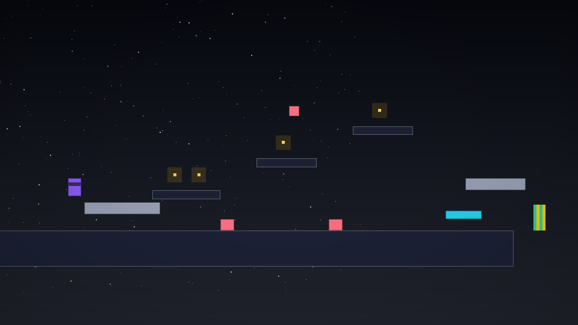
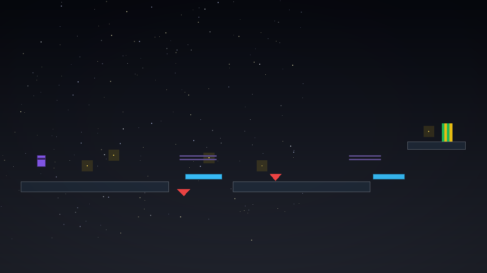
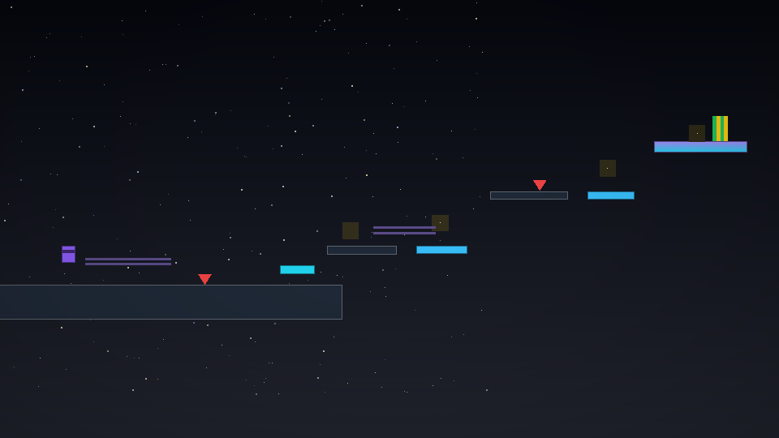
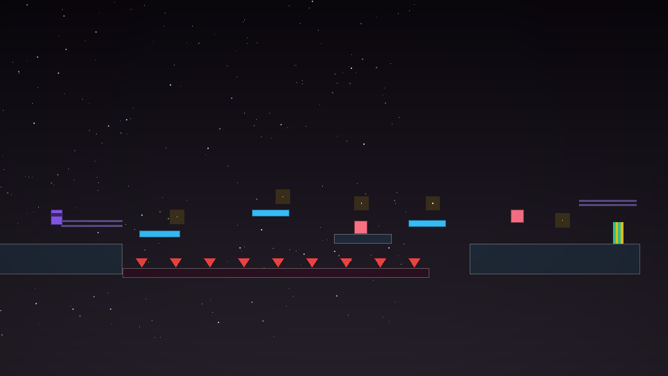

# DXN1 STUDIO 3


**A beautiful studio for code and games — one C++23 binary, zero dependencies.**
STUDIO 3 is the Spark 2D engine and a truecolor terminal studio compiled into a
single native core. It opens on a title card carrying the mark — the STUDIO 2
circuit spiral with a monolithic **3** carved into it, the way an engine logo
should be. Scenes are plain JSON — five of them, chained into a campaign.
The whole thing builds with `make`. There is
no Electron, no Node and no Python in this repo — the studio is one binary and
the binary is the product.

## Install — one line, fully launchable

Every push runs the full gauntlet in CI — a zero-warning C++23 build under
g++ **and** clang++, the engine selftest, a real headless frame for every
scene, and a live probe of the one-liner installer.

```bash
curl -fsSL https://raw.githubusercontent.com/DXN1-termux/DXN1-STUDIO/master/scripts/install.sh | bash
```

The installer checks `git` and a C++23 compiler (g++ or clang++, probing that
C++23 actually compiles), clones the repo, builds `native/build/dxn3-native`,
runs the engine selftest so you know it's green, and drops a `dxn3` launcher
into `~/.local/bin`. That's the whole dependency list: git, a compiler,
libstdc++. Then:

```bash
dxn3                              # the title card, then the playground
dxn3 scenes/level-1.dxn1.json     # any scene, by path
dxn3 --list-scenes                # what's installed, with entity counts
dxn3 --screenshot shot.png        # headless PNG of any scene
```

Prefer it by hand?

```bash
git clone https://github.com/DXN1-termux/DXN1-STUDIO.git
cd DXN1-STUDIO && make -C native && ./native/build/dxn3-native
```

## The studio, playing for real

Half-block truecolor pixels, deterministic starfield skies, gradient entities,
a HUD that counts your coins. These are real headless renders of the shipped
scenes — the same frames your terminal draws:

| the playground | the gap (level-1) |
|---|---|
|  |  |
| **the climb (level-3)** | **the gauntlet (level-4)** |
|  |  |

Goals chain the scenes into a five-scene campaign: **playground → level-1 (the
gap) → level-2 (the movers) → level-3 (the climb) → level-4 (the gauntlet) →
back home.** Coins score (+10, magnetized inside the scene's radius), spikes
respawn you with a camera shake, movers carry you across the gaps — and the
HUD counts it all: `COINS x/y · SCORE · TIME`, scene name on the right.
Level-3 goes vertical — two lifts, a springboard shortcut and a gradient
summit. Level-4 is the exam: nine fangs, three ferries, a saw-guarded island
and a spinning gate before the last door.

## Play

| key | action |
|-----|--------|
| `a` / `d` | run left / right |
| `w` / `space` | jump |
| `r` | reset to spawn |
| `+` / `-` | camera zoom (clamped 0.3×–4×) |
| `f` | zoom-to-fit the whole scene |
| `tab` | INSPECT — the live entity table, game paused |
| `e` | FILE VIEW — the scene's source, `j/k` scroll, `/` search with wrap-around |
| `p` | screenshot → `exports/<scene>-<n>.png` |
| `:` | the command bar (below) |
| `q` / `esc` | quit |

## The command bar

`:` opens a vim-style command line with honest errors — bad verbs, junk
numbers and out-of-range values are refused with usage, never silently
accepted:

| command | what it does |
|---------|--------------|
| `:scene <file>` | load any scene mid-flight |
| `:zoom in\|out\|<factor>` | camera zoom, clamped 0.3–4× |
| `:fit` | zoom-to-fit |
| `:reset` | back to spawn |
| `:w [file]` | save the scene (a `.bak` is kept) |
| `:wq` | save and quit |
| `:q` | quit |
| `:screenshot [file]` | PNG of the live frame |
| `:magnet <px>` | coin magnet radius, live |
| `:gravity <force>` | gravity, live |
| `:help` | list commands |

## Scenes are JSON

A scene is a `.dxn1.json` file — data only, no code:

```json
{
  "name": "level-1",
  "bg": "#0b0e1a",
  "gravity": 1500,
  "magnet": 120,
  "next": "scenes/level-2.dxn1.json",
  "camera": { "x": 200, "y": 250, "zoom": 0.85 },
  "entities": [
    { "name": "hero", "tag": "player", "x": 60, "y": 300, "w": 34, "h": 44 },
    { "name": "lift", "tag": "mover", "x": 620, "y": 372, "w": 140, "h": 20,
      "path": [ { "x": 620, "y": 372 }, { "x": 760, "y": 372 } ], "pspeed": 70 },
    { "name": "gem", "tag": "coin", "x": 340, "y": 290, "w": 22, "h": 22, "color": "#facc15" },
    { "name": "pain", "tag": "spike", "x": 590, "y": 430, "w": 50, "h": 28, "color": "#ef4444" },
    { "name": "out", "tag": "goal", "x": 1590, "y": 180, "w": 40, "h": 70, "color": "#22c55e" },
    { "name": "tip", "tag": "sign", "text": "ride the mover →", "color": "#a78bfa" }
  ]
}
```

Tags: `player` (the hero), `mover` (path-following platform with rider
carry), `coin` (score + magnetism), `spike` (respawn + shake), `goal`
(next-scene transition, locked after one touch), `ball` (perpetual demo
bounce), `sign` (floating text). Tagless entities are solid geometry.
Colors may set `color2` + `"fill": "gradient"`, and `spin` rotates them.

## Engine selftest + gates

```bash
make -C native test      # engine assertions: physics, movers, coins,
                         # magnetism, hazards, transitions, camera,
                         # command grammar, PNG writer vectors
scripts/gates.sh         # the full gauntlet
```

The gates are: a zero-warning `-std=c++23` build, the selftest, **every scene
must render one real headless frame**, zero electron-era files tracked, and
VERSION ↔ CHANGELOG consistency. No Node, no Python — the QA lane eats its
own dog food.

## Layout

```
native/src/spark.hpp/.cpp   the engine: AABB physics, movers + rider carry,
                            coins + magnetism, hazards, goal transitions,
                            camera follow + zoom + decay shake,
                            std::expected scene I/O
native/src/tui.hpp/.cpp     the face: truecolor half-block renderer,
                            gradients, HUD spans, text rails
native/src/logo32.hpp       the mark: the studio emblem as a 32×32
                            truecolor bitmap for the title card
native/src/cmd.hpp          the command bar grammar — honest usage errors
native/src/fx.hpp           the deterministic per-scene starfield
native/src/png.hpp          zero-dependency PNG writer (stored deflate)
native/src/shot.hpp         headless + in-game screenshots
native/src/json.hpp         recursive-descent JSON with \uXXXX → UTF-8
native/src/main.cpp         the studio shell: raw-mode input, fixed
                            timestep, title card, PLAY / INSPECT /
                            FILE VIEW / command modes
native/src/selftest.cpp     engine assertions
assets/                     the brand: emblem, banner, social card + SVG src
scenes/*.dxn1.json          the five-scene campaign — data only
scripts/install.sh          the curl one-liner
scripts/gates.sh            the quality gauntlet
```

## History

STUDIO 3 was born as an Electron app with a Python brain (v3.0.01–v3.0.04).
v3.0.05 ported the Spark engine to C++23 and played it in the terminal.
v3.0.06 deleted the Electron, web and Python stacks for good — the studio is
one binary now. v3.0.07 gave the studio its face: the mark descends from the
STUDIO 2 circuit spiral (preserved on the
[`ds2-archive`](https://github.com/DXN1-termux/DXN1-STUDIO/tree/ds2-archive)
branch) with a monolithic 3 carved into it, the title card greets every
launch, the HUD counts your coins, and the command bar whispers usage hints
while you type. v3.0.08 gave the studio somewhere to go: the campaign grew
from three scenes to five — the climb and the gauntlet — and the gauntlet
itself moved into CI, where g++, clang++ and the one-liner installer are
probed on every push.

MIT — DXN1-termux
