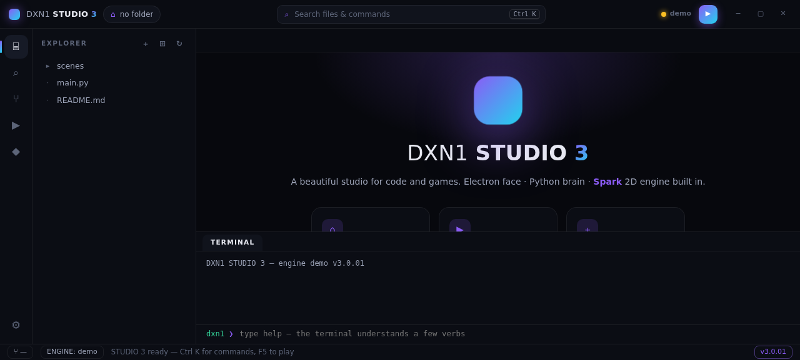
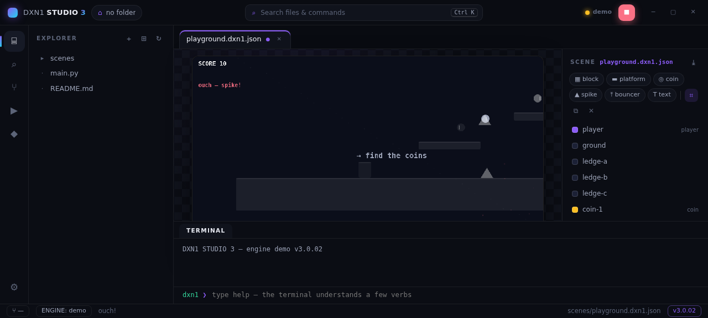
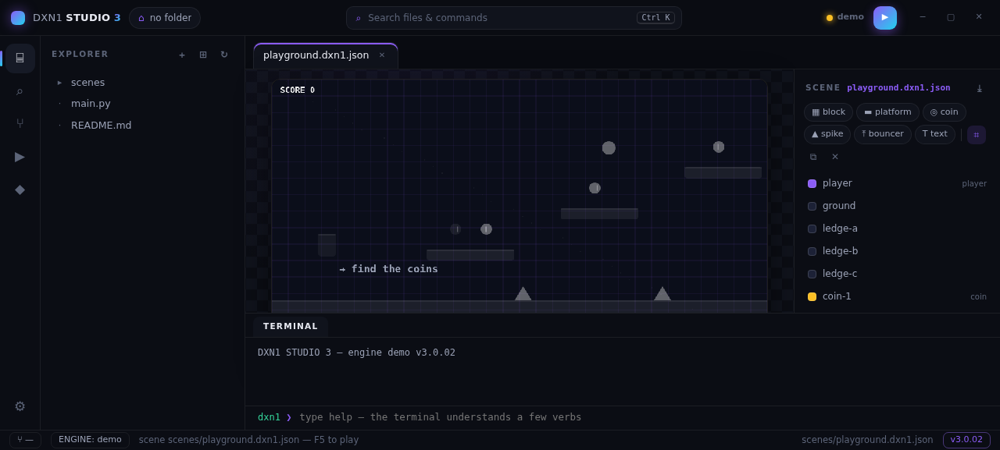
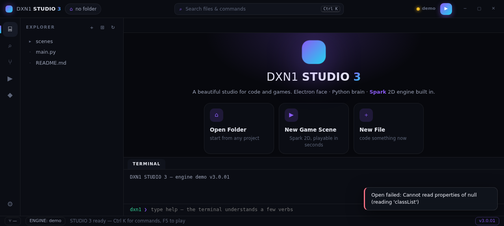

# DXN1 STUDIO 3


**A beautiful studio for code and games.** STUDIO 3 is a full rebuild:
the old Python/Tkinter app is retired (archived on the `ds2-archive`
branch) and this repo starts fresh, UI-first.

- **Electron face** — frameless window, dark glass design system,
  gradient accents, command palette, custom titlebar. The UI is the
  product: every pixel is meant.
- **Python brain** — `engine/` owns the workspace over a stdio JSON
  protocol (atomic writes, sandboxed paths, honest errors). Same brain,
  any face.
- **Native core in C++23** — `native/` is the Spark engine, ported to
  modern C++ and rendered in ANSI truecolor: the same scenes, the same
  physics, zero dependencies beyond libstdc++. `make -C native &&
  ./native/build/dxn3-native` and the studio plays in your terminal.
- **Spark 2D engine, built in** — scenes are plain JSON
  (`scenes/*.dxn1.json`), edited on-canvas and played with **F5**.
  Entities, AABB physics, platformer controller, moving platforms,
  coin magnetism, goal→next-scene transitions, particles, camera zoom
  and shake — 2D only, on purpose.
- **Source control, wired** — branch, changed files with M/A/D badges,
  commit box, history. Real git through the engine, an honest virtual
  git in demo mode.

## One-line install

Copy · paste · done — the installer checks your tools, clones STUDIO 3
and offers the desktop app or the zero-install browser demo:

```bash
curl -fsSL https://raw.githubusercontent.com/DXN1-termux/DXN1-STUDIO/master/scripts/install.sh | bash
```

One command, three ways in: the Electron desktop app, the zero-install
browser demo, and — if a C++23 compiler is present — the **native core**
builds itself and `dxn3 --native` plays Spark scenes right in your
terminal, truecolor and dependency-free.

Prefer to look before you leap?

```bash
curl -fsSL https://raw.githubusercontent.com/DXN1-termux/DXN1-STUDIO/master/scripts/install.sh -o install.sh
less install.sh && bash install.sh
```

Installer flags: `--dir somewhere` (clone location, default
`~/dxn1-studio-3`) · `--demo` (browser mode only — perfect for
Termux/Android) · `--run` (launch immediately). The script prints
every step and never touches anything outside its install directory
and `~/.local/bin` (the `dxn3` launcher).

## What it looks like

| | |
|---|---|
|  |  |
| *the welcome hero* | *playing the playground — Spark HUD live* |
|  |  |
| *scene editor: grid, entities, inspector* | *code: highlighting, minimap, find* |

## Run

```bash
npm install && npm start        # desktop (Electron + Python engine)
```

No npm? No problem:

```bash
./scripts/install.sh --demo     # or: python3 -m http.server -d renderer 8899
# then open http://localhost:8899 — the whole UI runs in demo mode
```

In demo mode the face carries its own virtual filesystem and a
simulated git history — every control works, honestly labelled
`ENGINE: demo`.

## Spark 2D — the built-in game engine

Play with **F5**. Edit without playing. The same canvas does both.

| Power | How |
|---|---|
| Entities | blocks, platforms, coins, spikes, bouncers, text labels |
| **Moving platforms** | `path: {toX, toY, speed}` — ping-pong shuttles that *carry* the player |
| **Goal → next scene** | tag an entity `goal`, set `"next": "scenes/level-2.dxn1.json"` — the run keeps playing across scenes |
| Editor camera | wheel zooms toward the cursor · middle-drag or Space+drag pans · ⊕ resets |
| On-canvas editing | click-select, drag with 8px snap (Alt = free), right-click toolbox: add-here, duplicate, delete, z-order |
| Motion rails | dashed cyan line shows where a mover travels |
| Tags | `coin` pickup · `hazard` respawn · `goal` finish · `player` you |
| **Coin magnetism** | `"magnet": 110` — coins drift toward you inside the radius; pull grows as they close in |
| **Camera shake** | hazards respawn you with a shake; `game.shake(power, seconds)` from code |
| Parallax | `parallax: [{speed, color, size, count}]` — layered star fields, per scene |
| Physics | AABB, per-entity gravity (opt-in), bouncy surfaces, world respawn |

Scenes are plain JSON — hand-edit them in the built-in editor, or wire
the inspector. Two demo levels ship: `playground` → goal → `level-2`
(movers!) → goal → back. An endless loop until you build your own.

## Native core — the same Spark, in C++23

`native/` is a complete, dependency-free C++23 port of the Spark
engine: the same scene JSON, the same AABB physics, movers, coins,
magnetism, hazards, goal transitions and camera shake — rendered in
**ANSI truecolor** with half-block pixels (two world pixels per
terminal cell) so the playfield is sharp and vivid in any modern
terminal.

```bash
make -C native                      # g++ -std=c++23 -O2, no other deps
./native/build/dxn3-native          # play the playground
./native/build/dxn3-native --scene scenes/level-2.dxn1.json
./native/build/dxn3-selftest        # 29 engine assertions
```

| Keys | Action |
|---|---|
| `a` / `d` or arrows | run left / right |
| `w` / `space` / `↑` | jump |
| `+` / `-` / `f` | zoom in / out / fit |
| `tab` | inspect — pause and read the entity table |
| `r` | reset to spawn |
| `q` / `esc` | quit |

Under the hood it is honest modern C++: `std::expected` for scene
loading, `std::print` for output, concepts-constrained clamps, ranges
over entities, and a fixed-timestep loop that mirrors the JS runtime
1:1. The quality gates build it and run its selftest on every push.

## The studio, feature by feature

- **Editor** — syntax highlighting (py/js/json/md/html/css), find +
  **replace** (Ctrl+F / Ctrl+H), **go-to-line** (Ctrl+G), **word
  autocomplete** (Ctrl+Space, frequency-ranked), bracket & quote
  auto-close with selection wrap, type-over closers, 2-space smart
  Tab, minimap with click-jump lens, word wrap, font sizes,
  **breadcrumbs** above every file.
- **Tabs** — drag to reorder, dirty dots, scene tabs and code tabs
  side by side.
- **Explorer** — hierarchical tree, new file/folder, rename, delete,
  persisted open folders.
- **Search** — project-wide grep with inline match highlighting,
  **grouped by file** with per-file counts.
- **Terminal** — real verbs: `ls cat new rm play theme accent grid ent
  find git status log zoom mm about date echo help`.
- **Command palette** — 24 commands + fuzzy file jump (Ctrl K / Ctrl P).
- **Settings** — dark/light theme, 5 accent colors, font sizes, word
  wrap, full keybinding table.
- **Statusbar** — branch, engine state, cursor position, version.

## Keyboard

| Keys | Action |
|---|---|
| `Ctrl K` | command palette |
| `Ctrl P` | go to file |
| `F5` | play / stop scene |
| `Ctrl S` | save |
| `Ctrl F` / `Ctrl H` | find / replace in file |
| `Ctrl G` | go to line |
| `Ctrl D` / `Del` | duplicate / delete entity |
| `Wheel` / `Space+drag` | zoom / pan the scene (edit mode) |
| `Ctrl \`` | toggle terminal |
| `Ctrl ,` | settings |
| `Ctrl Shift F` | search in project |

## Architecture

```
electron/    main + preload (spawn the engine, IPC, frameless window)
renderer/    index.html · styles.css (design system) · app.js · spark.js
engine/      the Python brain — stdio JSON bridge (python3 -m engine)
             files · scenes · git (status/log/commit), atomic + sandboxed
native/      the C++23 Spark core — same scenes, terminal studio,
             zero dependencies; dxn3-native + dxn3-selftest (make test)
scenes/      Spark scenes (*.dxn1.json) — playground + level-2
scripts/     install.sh · gates.sh (7 quality gates) · selftest.js
tests/       engine tests:  python3 -m unittest discover -s tests
```

The face never touches the disk directly — every mutation goes through
the engine protocol, so the same brain can later serve any face we
invent (web, terminal, mobile). When Python is absent the face stays
alive in demo mode and says so honestly.

## Quality — the gates

`bash scripts/gates.sh` runs six of them: `node --check` on every JS
file · `compileall` on the engine · full test suite · version-trio
consistency · scene JSON validity · the renderer selftest (highlighter
regressions, Spark schema, zoom + mover internals). Nothing ships red.

## The 24-hour plan (set by DXN1)

| Day | Focus |
|---|---|
| **Day 1 — today** | the UI: full Electron rebuild, design system, Spark playable, scene editor, git panel |
| **Day 2** | the engine, purely: Spark deepens (tilemaps, sprites, sound, export) |
| **Day 3** | the IDE functions: agents, plugins, the full toolkit |

Versions start at **v3.0.01** and grow by giant hourly updates:
v3.0.01 → v3.0.02 → v3.0.03 → … — every update is worth installing.

## License

MIT — build games with it.
